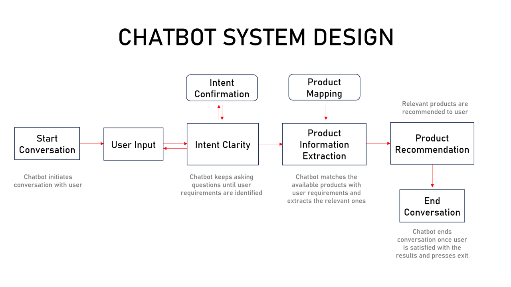
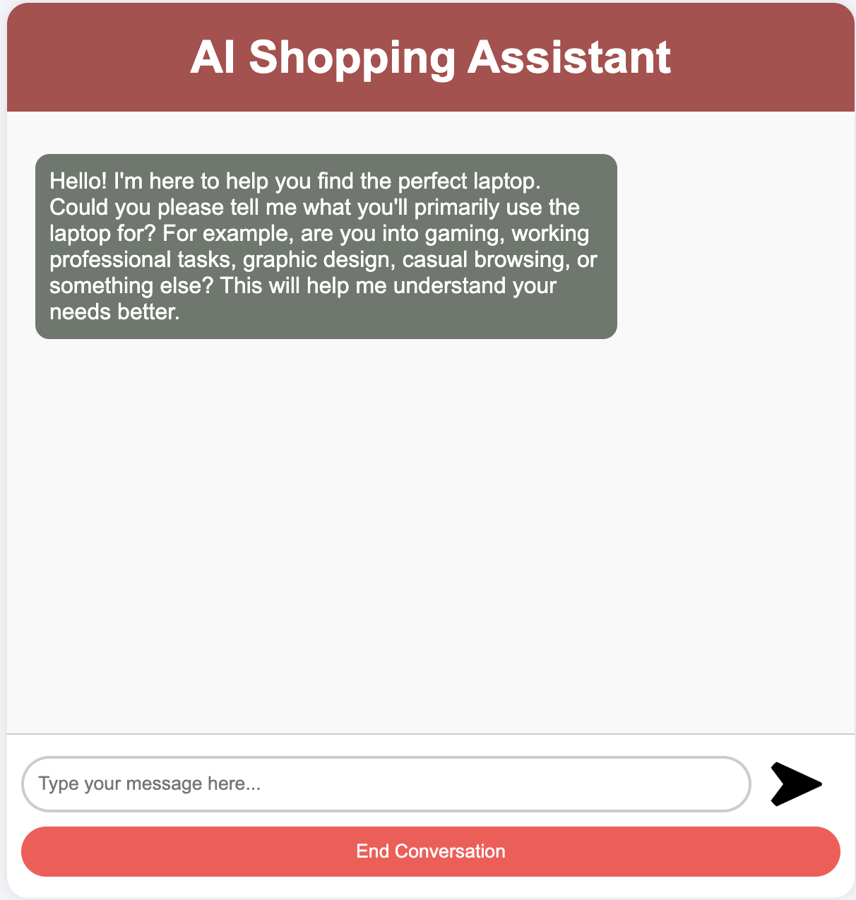
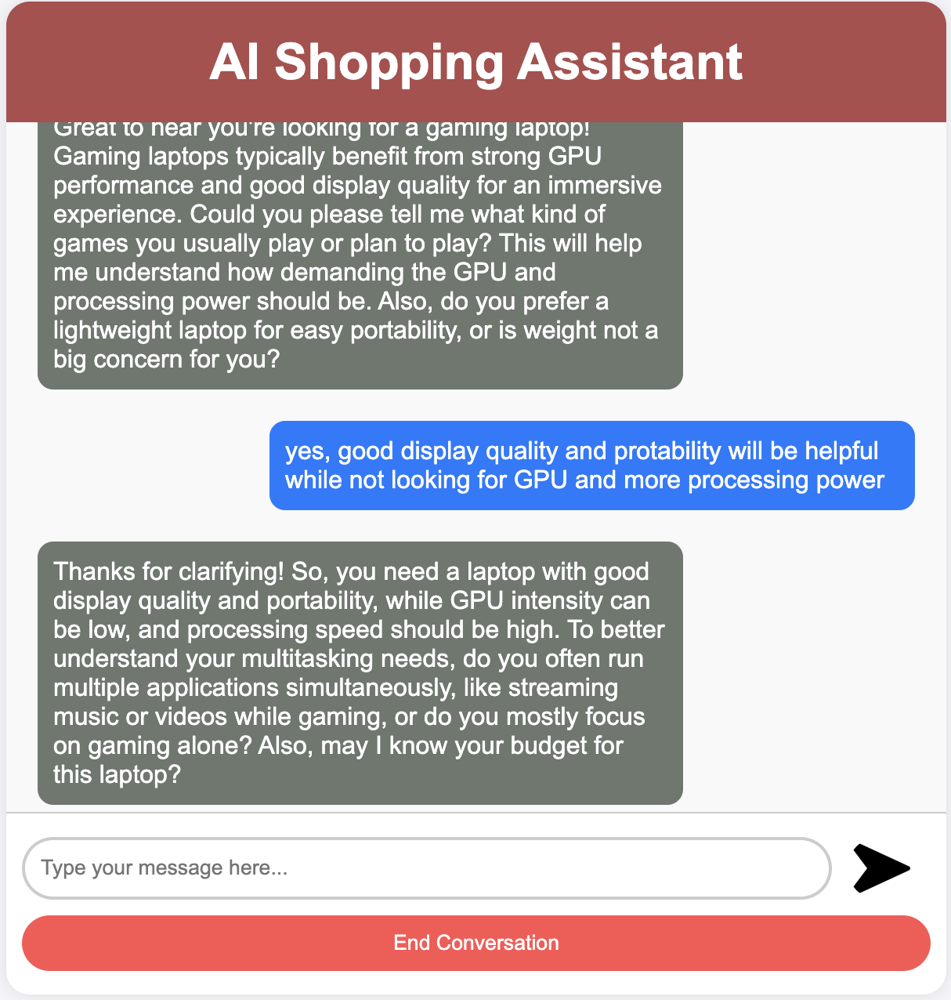
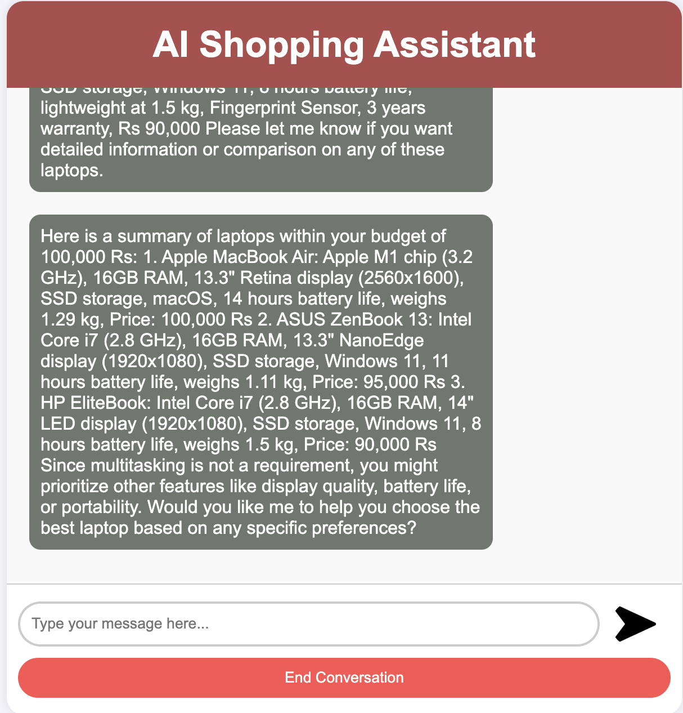
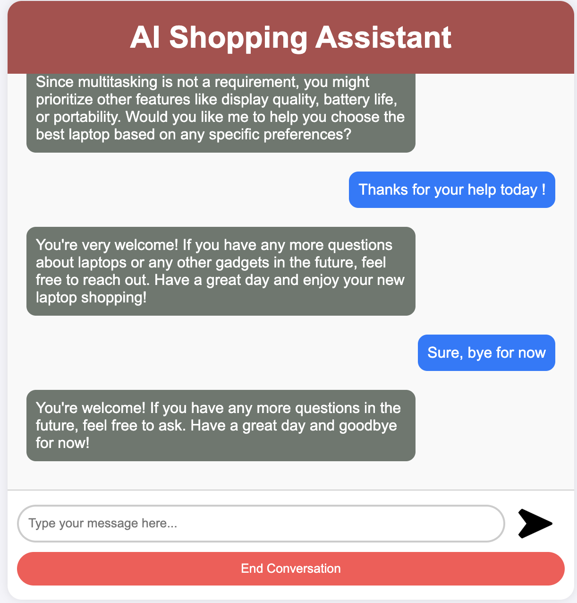

# ShopAssist AI


## 1. Background
Online shopping offers vast choices but often lacks the personalized guidance needed to navigate them effectively, leading to a potentially overwhelming experience for consumers. ShopAssist AI addresses this challenge by providing an intelligent chatbot solution. It leverages large language models alongside rule-based functions to deliver accurate, reliable, and personalized product information.

## 2. Problem Statement
The core challenge is to develop an intelligent chatbot capable of effectively parsing a diverse dataset of laptop information (including specifications and descriptions) to provide users with accurate, personalized recommendations tailored to their specific requirements and preferences.

## 3. Approach
ShopAssist AI employs a multi-stage approach to deliver tailored laptop recommendations:
1.  **Conversational Requirement Elicitation:** The chatbot initiates a natural language dialogue, leveraging Large Language Models (LLMs) to understand user needs. It dynamically asks pertinent questions to comprehensively gather specific requirements and preferences.
2.  **Structured Profile Generation & Product Matching:** As the conversation progresses, user requirements are systematically extracted and structured (e.g., into a JSON profile via function calling). This profile is then matched against the laptop dataset using rule-based logic and scoring mechanisms to identify the top 3 most suitable laptops.
3.  **Interactive Recommendation & Refinement:** The curated list of top laptops is presented to the user. The chatbot then facilitates further interaction, allowing users to ask detailed questions about the recommended products, compare options, and refine their choice, ensuring they find the ideal laptop.

## 4. System Functionalities
- **User Interface:** ShopAssistAI provides a user-friendly web interface where users can interact with the conversational AI assistant.
- **Conversational AI:** The core of ShopAssistAI is the conversational AI powered by OpenAI's chat model. It guides the user through the process by asking relevant questions and understanding their needs.
- **User Input Moderation:** User input is moderated using OpenAI's moderation API to ensure a safe and secure conversation.
- **User Profile Extraction:** The AI assistant extracts key information from the conversation to build a user profile that reflects their laptop preferences (budget, screen size, processing power, etc.) using OpenAI's function calling mechanism to convert a user requirement string into a JSON object.

We have a dataset `laptop_data.csv` where each row describes the features of a single laptop and also has a small description at the end. The chatbot will leverage large language models to parse this `Description` column and provide recommendations.

## 5. System Architecture

ShopAssistAI follows a client-server architecture. Users interact with the web interface hosted on a server running the Flask application. The application interacts with OpenAI's API for conversation generation and moderation and retrieves and compares laptop data from an external database.




## 6. Implementation Details

The Flask application utilizes various functionalities:

- **Routing:** Maps user requests to appropriate functions based on URLs.
- **Conversation Management:** Handles conversation initiation, response generation through OpenAI's chat model, and conversation history maintenance.
- **User Input Processing:** Captures user input, performs moderation checks, and extracts user profiles from conversation history (converting user input string to JSON using OpenAI Function calling).
- **Recommendation Logic:** Compares user profiles with laptop data, validates recommendations, and generates recommendation text.

  ### Major Functions
- `initialize_conversation()`: Initializes the variable conversation with the system message.
- `get_chat_completions()`: Takes the ongoing conversation as the input and returns the response by the assistant.
- `moderation_check()`: Checks if the user's or the assistant's message is inappropriate. If any of these is inappropriate, it ends the conversation.
- `intent_confirmation_layer()`: Evaluates if the chatbot has captured the user's profile clearly.
- `dictionary_present()`: Checks if the final understanding of the user's profile is returned by the chatbot as a Python dictionary.
- `compare_laptops_with_user()`: Compares the user's profile with the different laptops and comes back with the top 3 recommendations.
- `initialize_conv_reco()`: Initializes the recommendations conversation.


### Prerequisites
- Python 3
- OpenAI API Key(you have to add openai api key in the empty txt file (OpenAI_API_Key))

### Getting Started

To get started with ShopAssist AI, follow these steps:

1. **Clone the repository:**
   ```
   git clone https://github.com/umeshg1981/AIShoppingAssistant.git
   cd AIShoppingAssistant
   ```
2. **Lunch VS Code from Anaconda**
   - In VS Code go to `File` > `Open Folder...` and select the `AIShoppingAssistant` folder.
   - Open a terminal in VS Code (``Ctrl+` `` or go to `Terminal` > `New Terminal`).
2. **Install dependencies:**
```   
pip install -r requirements.txt
```
3. **Initialize the conversation:**  
```
python app.py
```
#### Note: This version includes steps to create and activate the Conda environment with Python 3.11.9 0r above, ensuring users set up python environment correctly before installing dependencies and running the application.


## 7. Appendix - B

User output example screenshot:











